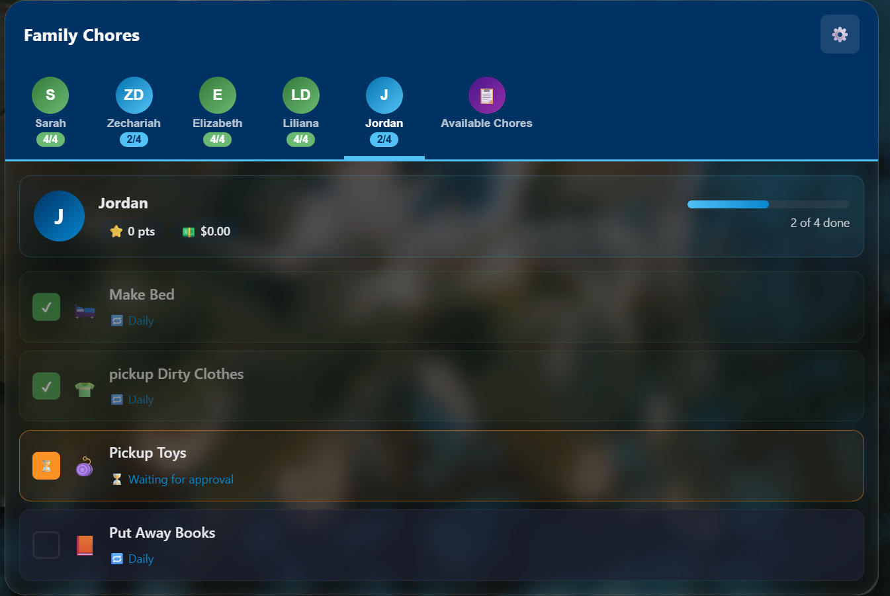

# Chore Tracker Card

A Home Assistant custom card for tracking family chores with points and allowance rewards — synced across every device and HA user in your home.



## Features

- **Family Members** — Add any number of family members with custom avatars
- **Assigned Chores** — Create chores and assign them to one or multiple members
- **Available Chores pool** — Optional bonus chores members can claim once their own list is done
- **Points & Allowance** — Assign point values and dollar amounts to each chore; earnings tally automatically
- **Private Totals** — The bottom of the card shows only the selected member's points and money, so siblings can't compare balances (an all-members scoreboard is opt-in)
- **Rewards & Cash Out** — Spend points on a customizable reward catalog, or cash out earned money
- **Weekly Streak Bonus** — Finish all assigned chores 7 days straight for +5 bonus points
- **Day-Scheduled Chores** — A chore set for Tuesday and Wednesday only appears on those days; daily and weekday chores reset at your local midnight
- **Automation Events** — Fires events on the HA bus when chores are completed, so you can automate lights, notifications, and payouts
- **Visual Editor** — Configure title and password right in the dashboard UI editor, no YAML needed
- **Cross-device Sync** — Data is stored in the dashboard config, shared by all HA users and devices; changes made on one device appear live on the others
- **Admin Console** — Parent console (password-gated) for managing members, chores, and the pool
- **Approval Mode** (optional) — Kids mark chores done, but points are only awarded after a parent approves them
- **Safe Deletes** — Destructive buttons require a second confirming tap
- **Auto Emoji** — Chores automatically get matching emoji icons based on their name, with manual override
- **HA Theme Support** — Uses your Home Assistant theme (works with light, dark, and glass themes)
- **Localized** — English, Spanish, German, French, and Dutch out of the box, following each user's HA language

## Installation

### HACS (recommended)
1. Add this repository as a custom HACS repository (Frontend category)
2. Install "Chore Tracker Card"
3. HACS registers the resource automatically

### Manual
1. Copy `chore-tracker-card.js` to your `/config/www/` folder
2. In Home Assistant go to **Settings → Dashboards → Resources**
3. Add `/local/chore-tracker-card.js` as a JavaScript module

## Configuration

```yaml
type: custom:chore-tracker-card
title: Family Chores
admin_password: "yourpassword"
```

| Option | Default | Description |
| --- | --- | --- |
| `title` | `Chore Tracker` | Card title shown in the header |
| `admin_password` | `1234` | Password for the admin console |
| `show_family_totals` | `false` | When `true`, the bottom of the card lists every member's points and money. Off by default so only the selected member's totals are visible |
| `require_approval` | `false` | When `true`, marking a chore adds it to a pending list; an admin approves (awards points) or rejects it in the admin console |
| `language` | *(HA user language)* | UI language override. Built in: `en`, `es`, `de`, `fr`, `nl`. Follows your HA profile language automatically when unset |
| `storage_key` | *(auto)* | Stable identity for the card's data. Stamped into the config automatically on first save — don't change it, or the card loses track of its data |
| `lovelace_url_path` | *(auto)* | Only needed if auto-detection of the dashboard fails; set to the dashboard's URL path |
| `data` | *(managed)* | The card's data store (members, chores, pool). Written by the card itself — don't edit by hand |

## How data is stored and synced

The card stores everything **inside its own entry in the dashboard configuration**, saved via Home Assistant's websocket API. That makes the data:

- shared across **all HA user accounts** (parents, kids, wall tablets)
- shared across **all devices** — phones, browsers, kiosks
- updated **live**: when someone checks off a chore, other open devices refresh automatically

The browser's `localStorage` is used only as a local cache and offline fallback. If a sync save fails (for example on a YAML-mode dashboard, which cannot be written to), the card shows a red warning banner and keeps changes on that device only.

> **Note:** YAML-mode dashboards are not supported for sync — the dashboard must be UI-managed (storage mode).

## Admin Console

Click the ⚙️ gear icon and enter the admin password to:

- Add / edit / delete family members
- Add / edit / delete chores with point and dollar values
- Assign chores to one or multiple members
- Set recurrence (one-time, daily, weekdays)
- Manage the Available Chores pool
- Reset a chore's completion status
- Reset a member's earnings

Deleting or resetting requires a second confirming tap, so a stray finger can't wipe anything.

> **About the password:** it's a convenience gate to keep kids out of the parent console, not a security boundary — anyone who can edit the dashboard can read it from the card config.

## Approval mode

Turn on **Require admin approval** in the card's visual editor (or set `require_approval: true` in YAML) and the flow becomes:

1. A member taps a chore — it turns orange with an ⏳ "Waiting for approval" label (tapping again withdraws the request; no points yet)
2. The admin console's **Chores** tab shows a *Pending Approval* list at the top
3. ✔ **Approve** marks the chore completed and awards the points/dollars; ✖ **Reject** returns it to not-done
4. Approved chores can only be undone by an admin (reset), not by the member

The `chore_tracker_chore_pending` event fires on each request, so you can send parents a notification to review.

## Rewards, cash out, and streaks

At the bottom of the card, the totals bar shows the **currently selected member's** points and money — deliberately not everyone's, so siblings aren't nudged into comparing balances. Tap it (or the 🎁 Rewards button on their tab) to open that member's wallet:

- **Redeem Points** — spend points from the reward catalog. Rewards they can't afford yet are greyed out.
- **Cash Out** — hand over their earned allowance and reset the balance to $0.
- Recent redemptions are listed in the wallet, and the full log lives in the admin console's **Rewards** tab.

The card ships with a starter reward catalog you can edit, reorder, or replace entirely in **Admin → Rewards**. Suggested costs assume a typical chore is worth about 5 points:

| Tier | Examples | Points |
| --- | --- | --- |
| Small treats | Pick the car music (10), soda with dinner (15), extra snack (15), 30 min tablet or games (20) | 10–20 |
| Weekly treats | Extra dessert (30), 20 minutes with Mom or Dad (30), game night pick (35), choose dinner (40), pick the movie (40), stay up 30 min late (45), skip a chore (50) | 30–50 |
| Big rewards | Pizza / takeout pick (75), ice cream or park outing (120), small toy or $5 trip (150), friend sleepover (175), big day out (200) | 75–200 |

If you'd rather show a family scoreboard, enable **Show everyone's totals at the bottom** in the visual editor (`show_family_totals: true`).

### Weekly streak bonus

Completing **all assigned chores** (extras claimed from the pool don't count) every day for 7 days straight earns **+5 bonus points**, and again for each further 7-day run. Current streaks show as a 🔥 chip on the member's tab and in their wallet.

### Points or money on extra chores

An Available Chore that offers **both** points and a dollar value makes the claimer choose one when they claim it — they earn that reward only, never both. Chores offering just one reward type are claimed with no extra step.

## Available Chores (pool)

The pool holds optional extra chores that members can **claim** — but only after completing **all** of their currently assigned chores. Claiming asks which eligible member is taking the chore and moves it to their personal list.

## Recurring & day-scheduled chores

Each chore has a recurrence setting in the admin console:

| Setting | Shows up | Resets |
| --- | --- | --- |
| One-time / No reset | Every day | Never (until an admin resets it) |
| Daily | Every day | Every day at local midnight |
| Weekdays (Mon–Fri) | Mon–Fri only | Each weekday at local midnight |
| Only on chosen days | Only on the days you tick | On each of those days |

So a chore set for **Tue + Wed** is simply absent from everyone's list on Monday, Thursday, Friday, and the weekend — no clutter, and the "2 of 5 done" progress counts only what's actually due today.

**Earnings are kept** across resets — points and dollars are only removed if a chore is manually unchecked or an admin resets it.

Streaks understand the schedule too: a day where nothing was scheduled keeps a streak alive rather than breaking it, and the current day never breaks a streak before it's over.

## Automation events

The card fires events on the Home Assistant bus that you can use as automation triggers:

| Event | When | Data |
| --- | --- | --- |
| `chore_tracker_chore_completed` | A chore is completed (or approved, in approval mode) | `member`, `chore`, `points`, `dollars` |
| `chore_tracker_chore_pending` | A member requests approval for a chore (approval mode) | `member`, `chore` |
| `chore_tracker_streak_bonus` | A member completes 7 straight perfect days | `member`, `days`, `points` |
| `chore_tracker_reward_redeemed` | Points spent on a reward | `member`, `reward`, `points`, `points_remaining` |
| `chore_tracker_cash_out` | Earned money cashed out | `member`, `amount` |
| `chore_tracker_all_done` | A member finishes their whole list | `member`, `total_points`, `total_dollars` |

Example — flash a light when a kid finishes all their chores:

```yaml
trigger:
  - platform: event
    event_type: chore_tracker_all_done
action:
  - service: light.turn_on
    target:
      entity_id: light.living_room
    data:
      flash: short
```

## Emoji matching

Chores are automatically matched to emoji based on keywords in the title (e.g., "vacuum" → 🧹, "dishes" → 🍽️, "laundry" → 👕). You can manually override the emoji for any chore in the admin console.

## Theme support

The card follows your active HA theme via standard CSS variables and renders inside a real `ha-card` element, so themed backgrounds, blur, and glass effects apply. The header is Navy Blue (`#003366`) with Light Blue accents (`#0288D1` / `#4FC3F7`).
